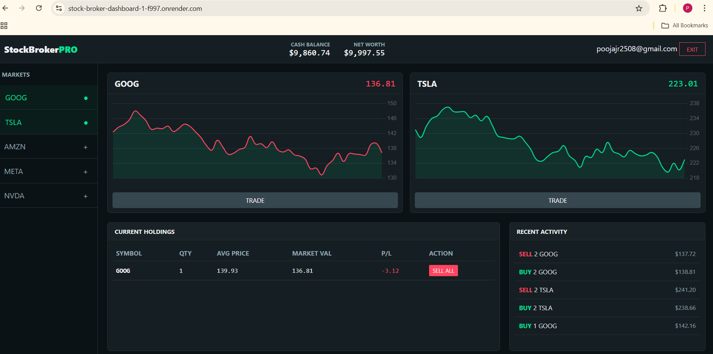

#  StockBrokerPro — Real-Time Trading Dashboard


** Live Demo:** [Launch Application](https://stock-broker-dashboard-1-f997.onrender.com)

---

##  Project Overview

**StockBrokerPro** is a full-stack financial simulation platform designed to mimic the high-frequency nature of a real stock trading desk.

Unlike traditional web apps that require page refreshes to see new data, this project utilizes **WebSockets** to push market data to the client in real-time. Users can watch stock prices fluctuate second-by-second, execute instant buy/sell orders, and track their portfolio performance dynamically.

###  Key Objectives
* **Simulate Real-Time Latency:** Handling asynchronous data streams using `Socket.io`.
* **Complex State Management:** Managing cash, holdings, and transaction history without a database (In-Memory Architecture).
* **Interactive Visualization:** Rendering live moving charts that respond immediately to server events.

---

##  System Architecture

The application follows a **Client-Server** architecture decoupled for scalability:


1.  **The Backend (Node.js/Express):**
    * Acts as the "Market Maker," generating random price fluctuations for stocks (GOOG, TSLA, AMZN, etc.) every 2 seconds.
    * Validates all trade logic (e.g., ensuring the user has sufficient funds).
    * Broadcasts updates to all connected clients via a **WebSocket** channel.

2.  **The Frontend (Vanilla JS/Chart.js):**
    * Maintains a persistent connection to the server.
    * Listens for `market-update` events and updates the DOM and Charts immediately.
    * Sends `trade-order` events (Buy/Sell) back to the server.

---

##  Features

###  Real-Time Market Watch
* **Live Ticker:** Stock prices update automatically without user intervention.
* **Dynamic Charting:** Interactive line graphs powered by Chart.js that visualize price history for the active session.

###  Trading Engine
* **Buy/Sell Logic:** Execute trades instantly. The system calculates cost, updates cash balance, and modifies portfolio quantity.
* **Validation:** Prevents overdrafts (insufficient funds) or short-selling (selling stocks you don't own).

###  Portfolio Management
* **Live P/L Tracking:** Calculates "Profit & Loss" in real-time based on the difference between the *Average Buy Price* and the *Current Market Price*.
* **Transaction Logs:** detailed history of every action taken during the session.

---

##  Tech Stack

| Area | Technology | Usage |
| :--- | :--- | :--- |
| **Frontend** | **HTML5, CSS3** | Structure and responsive dark-mode UI. |
| **Logic** | **JavaScript (ES6+)** | DOM manipulation and client-side logic. |
| **Real-Time** | **Socket.io-client** | Bi-directional communication with the server. |
| **Visualization** | **Chart.js** | Rendering live HTML5 Canvas charts. |
| **Backend** | **Node.js** | Server runtime environment. |
| **Framework** | **Express.js** | Handling HTTP requests and routing. |
| **Server Logic** | **Socket.io** | Broadcasting events to connected clients. |
| **Deployment** | **Render** | Hosting (Web Service for API, Static Site for Client). |

---

##  Local Setup Instructions


1.  **Clone the repository**
    ```bash
    git clone [https://github.com/Pooja5280/stock-broker-dashboard.git](https://github.com/Pooja5280/stock-broker-dashboard.git)
    cd stock-broker-dashboard
    ```

2.  **Start the Backend Server**
    ```bash
    cd server
    npm install
    node index.js
    ```
    *Server runs on port 3001*

3.  **Start the Client**
    * Open `client/script.js` and change the `SERVER_URL` to:
      ```javascript
      const SERVER_URL = "http://localhost:3001";
      ```
    * Open `client/index.html` in your browser.

---

##  Screenshots



---

## 👤 Author

**Pooja**
* **GitHub:** [View Profile](https://github.com/Pooja5280)

---

